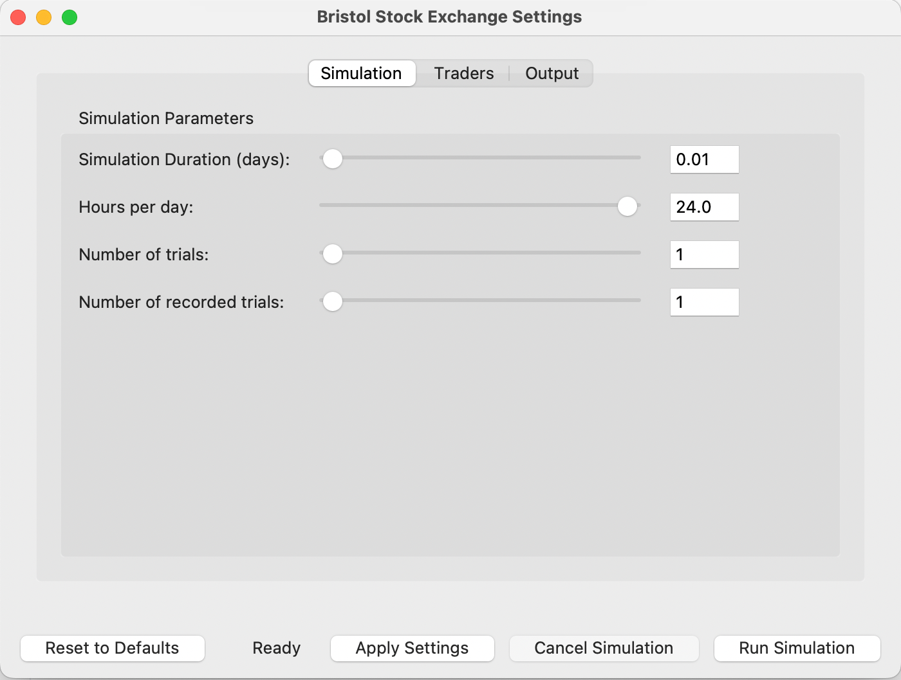

# Bristol Stock Exchange Simulation

A GUI-enhanced implementation of Dave Cliff's Bristol Stock Exchange (BSE) - a simple minimal simulation of a limit order book financial exchange.



## Overview

This project extends the original Bristol Stock Exchange simulation by adding:

1. An intuitive graphical user interface for easier interaction with the simulation
2. Automated graph generation tools for visualizing trading data
3. Comprehensive analysis scripts for evaluating trading strategies
4. An ACM-style report documenting methodologies and findings

This work was completed as coursework for a [University of Nottingham](https://www.nottingham.ac.uk/computerscience/) module.

## Installation

Clone the repository:

```bash
git clone https://github.com/andriskokins/BristolStockExchange.git
cd BristolStockExchange
```

### Requirements

- Python 3.12+
- Required packages:
  - numpy
  - pandas
  - matplotlib
  - seaborn

Install dependencies:

```bash
pip install -r requirements.txt
```

## Usage

To launch the GUI and start configuring your simulation:

```bash
python bse_settings.py
```

### Using the GUI

1. Configure simulation parameters (number of traders, time periods, etc.)
2. Select trader types and strategies
3. Run the simulation
4. View and export results

## Project Report

📄 **[View the full project report](docs/report.pdf)**

This report details:
- The methodologies used in developing the GUI
- Analysis of different trading strategies
- Performance evaluation metrics
- Experimental results and conclusions

## Original Work

This project is based on the Bristol Stock Exchange simulation developed by [Dave Cliff](https://github.com/davecliff/BristolStockExchange). The original code has been extended with additional features while maintaining the core functionality.

## License

This project is licensed under the MIT License - see the [LICENSE](LICENSE) file for details.

## Acknowledgements

- Dave Cliff for the original Bristol Stock Exchange simulation
- University of Nottingham for the coursework opportunity